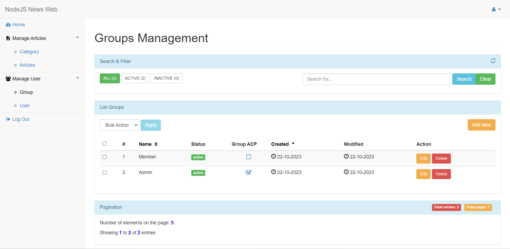

# GIAO DIỆN
## Trang chủ

## Trang bài viết theo danh mục

## Trang chi tiết bài viết

## Trang quản lý bài viết

## Trang quản lý danh mục

## Trang quản lý user

## Trang quản lý group

## Trang user profile

## Trang thay đổi mật khẩu

# CHỨC NĂNG
- Thêm, sửa, xóa bài viết
- Thêm, sửa, xóa danh mục
- Thêm, sửa, xóa user
- Thêm, sửa, xóa group
- Đăng nhập
- Phân quyền user (Chỉ user có quyền mới có thể truy cập trang quản lý user và group)
- Thay đổi profile
- Thay đổi mật khẩu

# CÔNG NGHỆ SỬ DỤNG
- NodeJS (Express)
- View Engine: EJS
- DBMS: MongoDB
